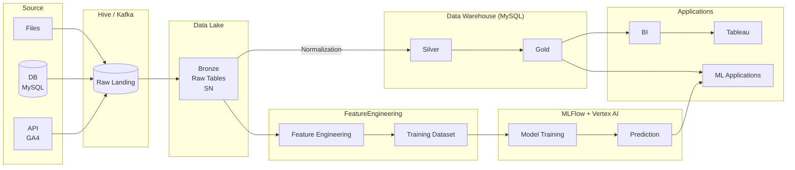

# tkr102

## Resources
### Document
https://docs.uuboyscy.dev/

### Note
- Gemini Notebook
    https://notebook.google.com/notebook/a4d65f7e-bfee-4d71-94b6-a43eee18ede1
- Google Docs
    - [Docker](https://docs.google.com/document/d/1tcg5ziQpd8KzPFv5vUDhNX1wMSQvTljlw_XZoqwQ-HY/edit?usp=sharing)
    - [Data Pipeline](https://docs.google.com/document/d/1uDstMGmnkvU2fan3sZ5PRfrT4YwGLcxaL7WndQe67ok/edit?usp=sharing)
    - [GCP](https://docs.google.com/document/d/1JkGc_wvZ5JsrrM5PARqqHG0kKHHmWocEEEmynCiYTb4/edit?usp=sharing)

### Data Pipeline Overview

